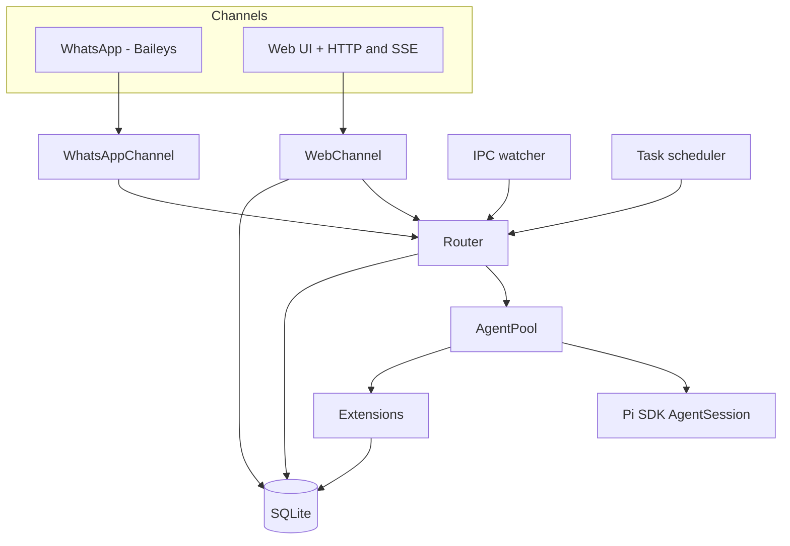

# `piclaw` architecture

This document outlines the main components, how they fit together, and where the code lives.

## Component overview



## Code layout (high level)

```
piclaw/src/
├── index.ts                 # Entry point
├── cli.ts                   # CLI parsing
├── runtime.ts               # Service startup orchestration
├── config.ts                # Env + config.json
├── router.ts                # Message routing
├── agent-pool.ts            # AgentSession pool
├── agent-pool/              # Session helpers
├── agent-control/           # Slash command handling
├── extensions/              # Tool registration (attach_file, search_messages, ...)
├── channels/                # WhatsApp + Web channels
├── tools/                   # Bash tracking + optional context wrappers
├── db/                      # SQLite schema + accessors
└── task-scheduler.ts        # Cron/interval scheduling
```

## Notes

- The agent pool keeps one warm session per chat JID and evicts idle sessions after a TTL.
- The web UI is the primary interface; the WhatsApp channel is optional.
- Web and WhatsApp share the same storage and agent pool.
- Scheduled tasks and IPC messages are routed through the same core workflow.

For the message‑level flow, see [runtime-flows.md](runtime-flows.md).
